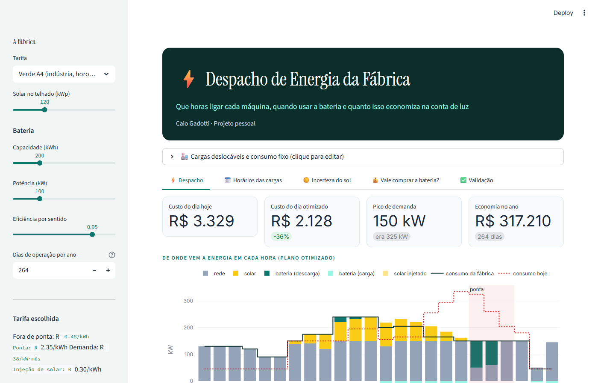
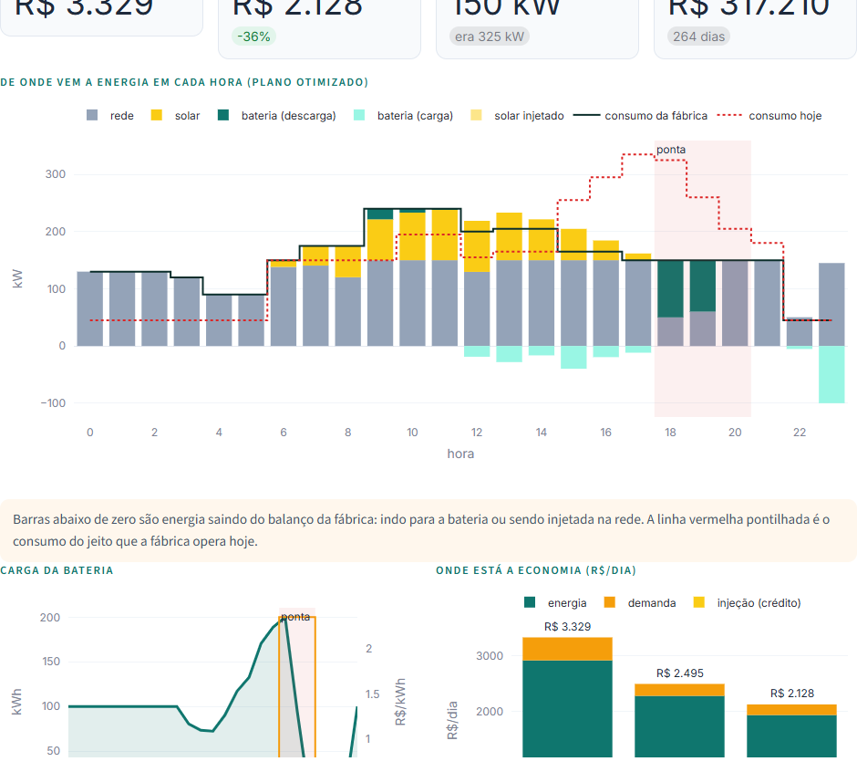
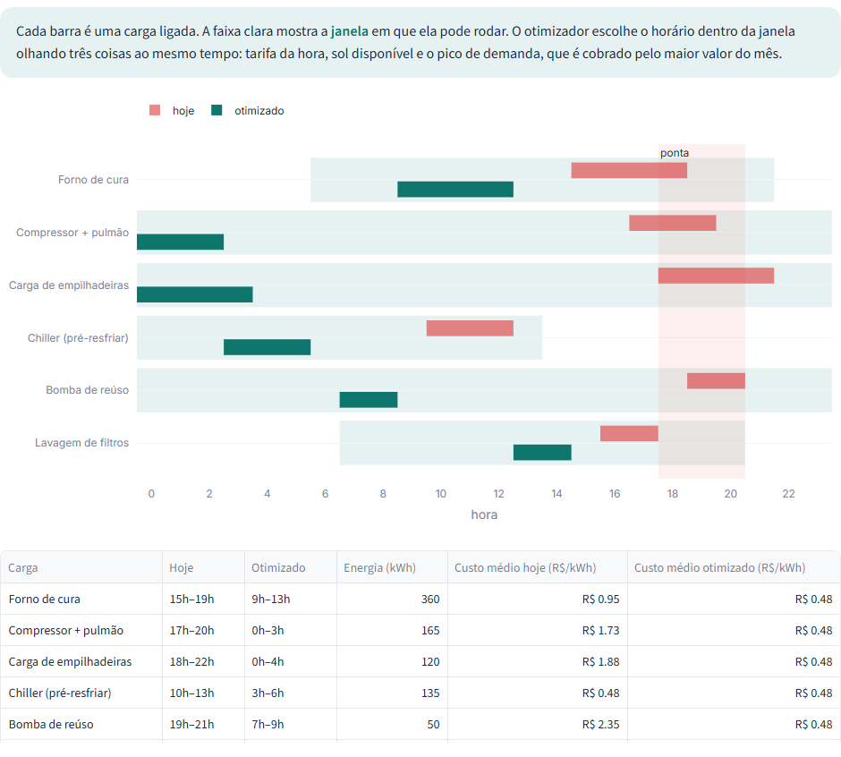
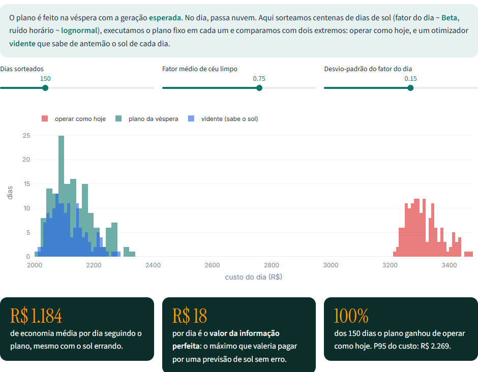
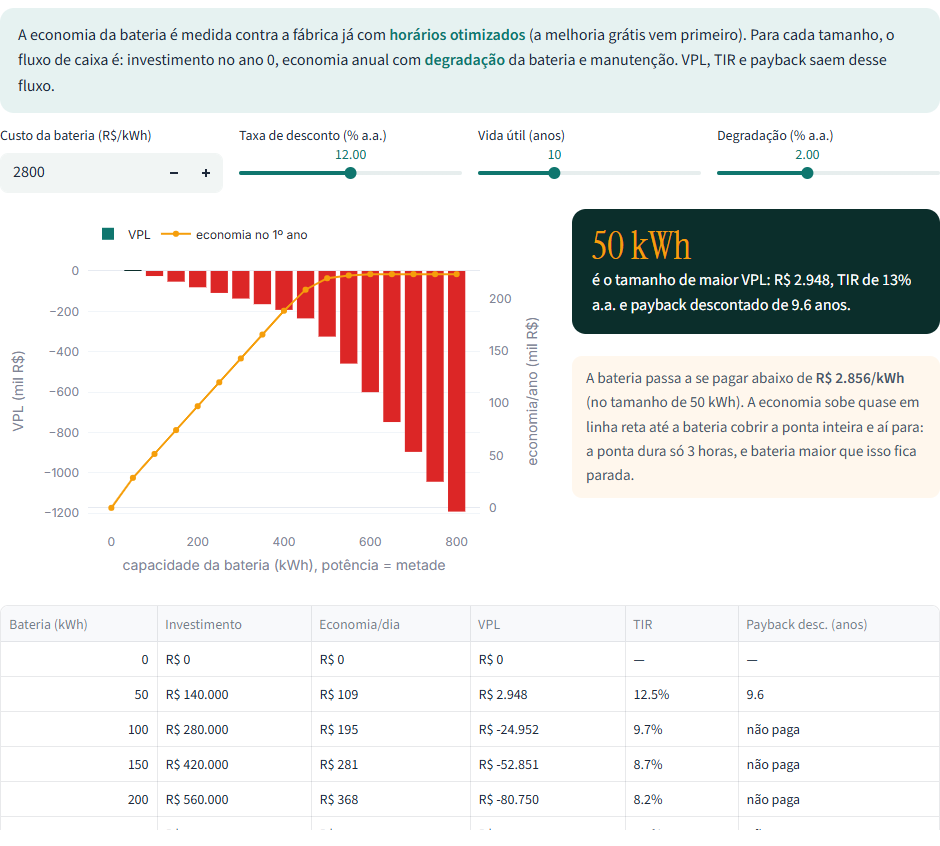

<div align="center">

# Factory Energy Dispatch

**When should each machine run to cut the power bill?**

An interactive dashboard that optimizes a factory's energy day: when to run the loads that can
move in time, when to charge and discharge a battery and how much rooftop solar to use, under a
time-of-use tariff with a peak demand charge.

[](https://www.python.org)
[](https://docs.scipy.org/doc/scipy/reference/generated/scipy.optimize.milp.html)
[](https://streamlit.io)
[](https://plotly.com/python/)
[](tests/)

`Same cost as brute force over 6,006 combinations, solved in 14 ms`

[Português](README.md) &nbsp;·&nbsp; **English**

</div>



> The interface is in Portuguese. Main terms: *rede* = grid, *ponta* = peak hours,
> *demanda* = demand charge, *carga* = load, *bateria* = battery.

---

## The problem

Under Brazil's industrial time-of-use tariff, a kWh during peak hours (6 pm to 9 pm) costs about
five times a kWh at any other time. The bill also charges for **demand**: the highest consumption
recorded in the month, in kW, even if it only lasted one hour.

Many factory loads don't need a fixed time slot. The curing oven can run in the morning or the
afternoon, forklifts can charge overnight, the chiller can pre-cool before the shift. The project's
question is:

> Given what has to run, the expected sun and a battery, what is the cheapest energy plan for the day?

## The model

A mixed-integer linear program (MILP), solved with HiGHS through `scipy.optimize.milp`, in
one-hour steps:

| Decision | Type | Bounds |
|---|---|---|
| Grid purchase each hour | continuous | ≥ 0 |
| Solar exported to the grid | continuous | ≤ that hour's generation |
| Battery charge and discharge | continuous | ≤ battery power |
| Battery state of charge | continuous | between 0 and capacity; ends the day at the starting charge |
| Start time of each load | **binary** | only starts that fit the load's window |
| Peak demand | continuous | ≥ grid purchase in every hour |

**Objective:** Σ tariff(h) × grid(h) − export × credit + peak × demand tariff / 30.

**Balance every hour:** grid + solar + discharge = fixed load + running loads + battery charge + export.

**Assumptions:** a typical operating day, known fixed-load forecast, the same battery efficiency in
both directions, and illustrative tariffs in the range of São Paulo utilities.

## What each tab shows

| Tab | Question | Result with the default factory |
|---|---|---|
| Despacho (dispatch) | What does the day cost and where does each hour's energy come from? | from R$ 3,329 to R$ 2,128 per day (−36%); peak from 325 kW to 150 kW |
| Horários das cargas (load schedule) | When should each load run? | every load leaves peak hours; rescheduling alone delivers 69% of the savings, with no investment |
| Incerteza do sol (solar uncertainty) | What if the sun doesn't show up as forecast? | the day-ahead plan beat current operation on 100% of 150 sampled days; value of perfect information: R$ 18/day |
| Vale comprar a bateria? (battery) | Which size has the best NPV? | at R$ 2,800/kWh only the small battery (50 kWh) pays off; break-even at R$ 2,856/kWh |
| Validação (validation) | Does the optimizer really find the best plan? | same cost as checking all 6,006 combinations; constraints checked on the plan |

<p align="center">
  
  
</p>

The surprising part is that **not every load moves to the middle of the night**. If they all did,
the peak would move with them and the demand charge would go up. The optimizer spreads the loads to
keep the peak low and pulls the ones that fit into midday, when solar pays for the energy.

<p align="center">
  
  
</p>

### Solar uncertainty

The plan is made the day before with the expected generation. The tab samples hundreds of days:
the day's clear-sky factor comes from a **Beta** distribution with the chosen mean and spread, and
each hour adds **lognormal** noise (a passing cloud). For each sampled day the dashboard computes
three costs: operating as today, following the fixed day-ahead plan, and a "clairvoyant" optimizer
that knows that day's sun. The gap between the last two is the **value of perfect information**,
the most a perfect weather forecast would be worth.

### Battery feasibility

Battery savings are measured against the factory with optimized schedules already in place, since
that improvement is free and comes first. The cash flow includes the investment, yearly capacity
degradation and maintenance at 1% of the investment per year. NPV, IRR, discounted payback and the
price per kWh at which the battery starts paying off all come from that flow.

## Validation

| Test | What it checks |
|---|---|
| `test_milp_bate_com_forca_bruta` | with 3 loads, the MILP finds the same cost as checking every combination |
| `test_custo_direto_igual_ao_lp_com_horario_fixo` | the solver's cost matches a direct calculation with no solver |
| `test_balanco_de_energia_fecha_toda_hora` | supply = demand in all 24 hours |
| `test_bateria_respeita_limites_e_dinamica` | state of charge, power and efficiency consistent hour by hour |
| `test_cargas_dentro_da_janela` | no load outside its allowed window |
| `test_bateria_nunca_piora` | a bigger battery never raises the optimal cost |
| `test_tarifa_unica_sem_demanda_nao_tem_o_que_deslocar` | with a flat price and no demand charge, optimizing doesn't change the cost |
| `test_executar_com_o_sol_previsto_reproduz_o_custo` | the execution simulator reproduces the plan's cost |
| `test_sorteio_solar_tem_a_media_pedida` | the Beta × lognormal sampler hits the chosen clear-sky mean |
| `test_financas` / `test_preco_de_equilibrio_zera_o_vpl` | NPV, IRR, payback and break-even price |

```bash
python -m pytest tests
```

## Running it

```bash
git clone https://github.com/caiogadotti/despacho-energia-fabrica.git
cd despacho-energia-fabrica
pip install -r requirements.txt
streamlit run app.py
```

### Deploying to Streamlit Community Cloud

1. Sign in at [share.streamlit.io](https://share.streamlit.io) with your GitHub account.
2. Click **Create app** and pick this repository, branch `main`, file `app.py`.
3. Click **Deploy**. The light theme comes from `.streamlit/config.toml`.

## Layout

```
app.py                  Streamlit dashboard (five tabs)
otimizador.py           dispatch MILP, solar sampling, execution simulation and finance
tests/test_otimizador.py
.streamlit/config.toml  visual theme
docs/                   README images
```

## References

- ANEEL. *Procedimentos de Regulação Tarifária (PRORET)*, Submodule 7.1. Green and blue time-of-use tariffs.
- PALENSKY, P.; DIETRICH, D. Demand side management: demand response, intelligent energy systems, and smart loads. *IEEE Transactions on Industrial Informatics*, v. 7, n. 3, p. 381-388, 2011.
- HUANGFU, Q.; HALL, J. A. J. Parallelizing the dual revised simplex method. *Mathematical Programming Computation*, v. 10, p. 119-142, 2018. (HiGHS)
- BIRGE, J. R.; LOUVEAUX, F. *Introduction to Stochastic Programming*. 2nd ed. Springer, 2011. (value of perfect information)
- GITMAN, L. J. *Principles of Managerial Finance*. Pearson.

---

Caio Gadotti · Personal project.
